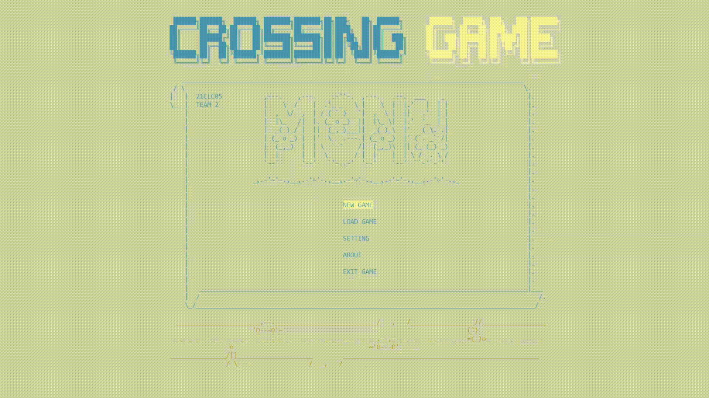
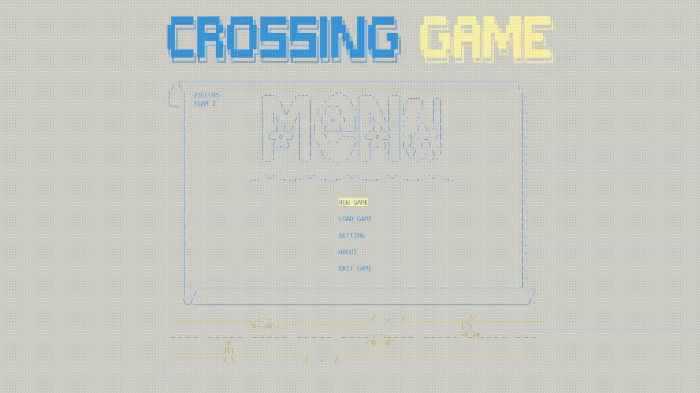
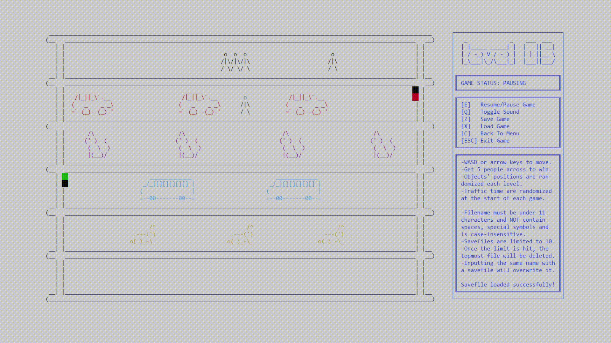
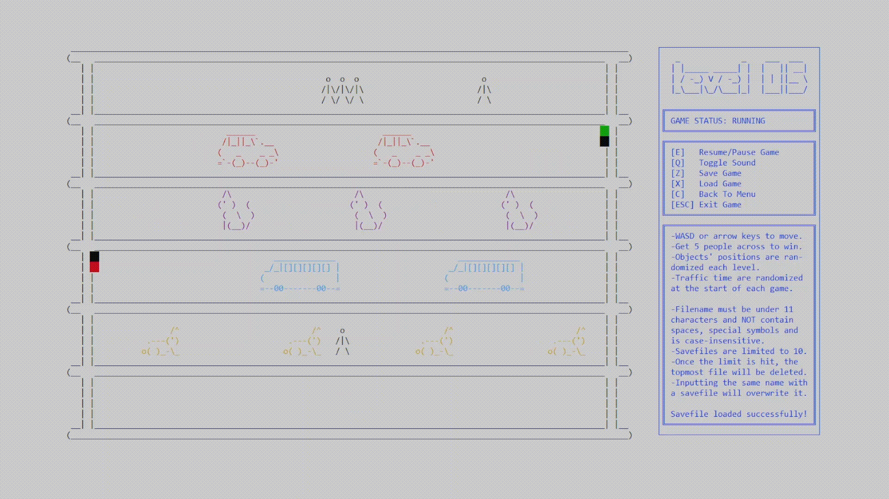

# Crossing Game

Game project for the HCMUS' 2022 Object-Oriented Programming course.

  
  

  
  

## Getting Started

### Prerequisites

* Windows 10 or 11
* ***For development:***
  * Visual Studio 2022
  * C++20 & C17

### Installation

* Clone the repo

## Usage

### To play

1. Open `Release` folder
2. Run `CrossingGame.exe`

### To peruse the code

* Run `CrossingGame.sln`

## Built With

[vsicon]: https://skillicons.dev/icons?i=visualstudio&theme=dark
[vsurl]: https://visualstudio.microsoft.com/vs/

[cppicon]: https://skillicons.dev/icons?i=cpp&theme=dark
[cppurl]: https://en.cppreference.com/w/cpp/20

[cicon]: https://skillicons.dev/icons?i=c&theme=dark
[curl]: https://en.cppreference.com/w/c/17

[windowsicon]: https://cdn.jsdelivr.net/gh/devicons/devicon/icons/windows8/windows8-original.svg
[windowsurl]: https://www.microsoft.com/en-us/windows/

| [![VisualStudio2022][vsicon]][vsurl] | [![C++20][cppicon]][cppurl] | [![C17][cicon]][curl] | [![Windows][windowsicon]][windowsurl] |
| :-: | :-: | :-: | :-: |
| 2022 | 20 | 17 | 10 & 11 |

## Meet The Team

  &nbsp;&nbsp;&nbsp;
  &nbsp;&nbsp;&nbsp;
  &nbsp;&nbsp;&nbsp;
  

(<a href="#readme-top">back to top</a>)

